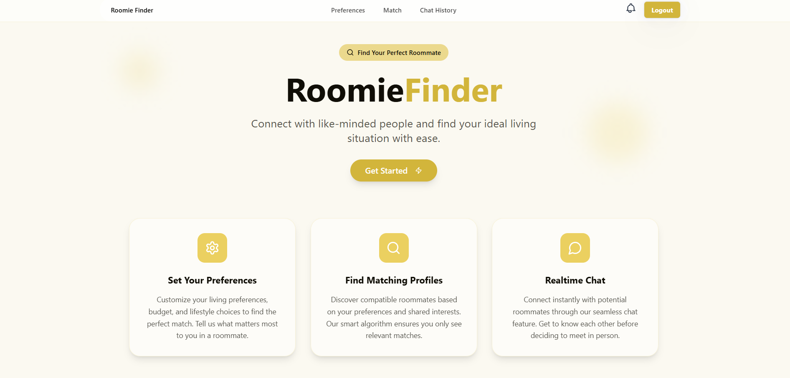
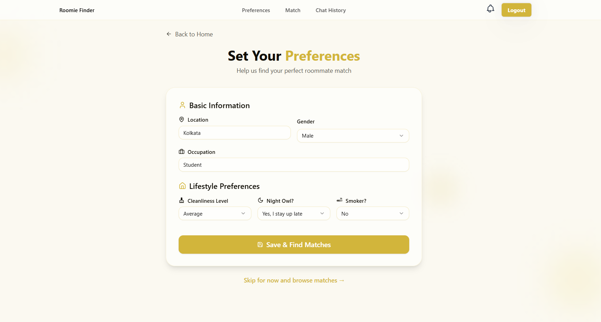
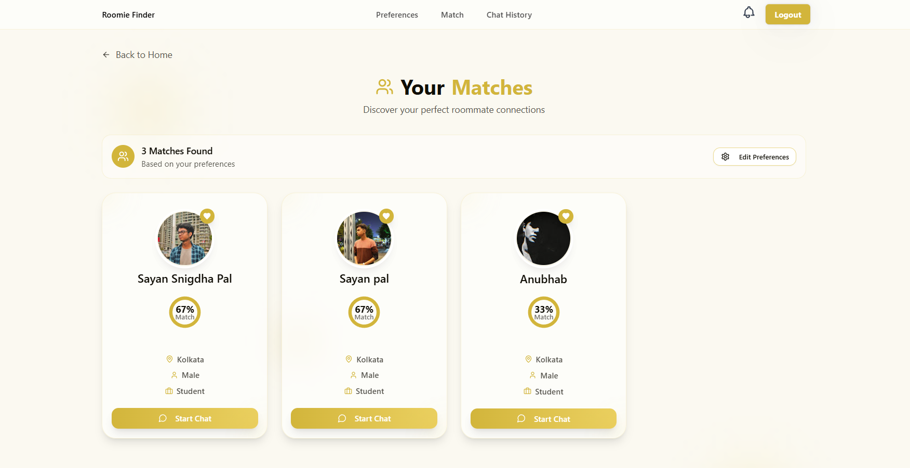
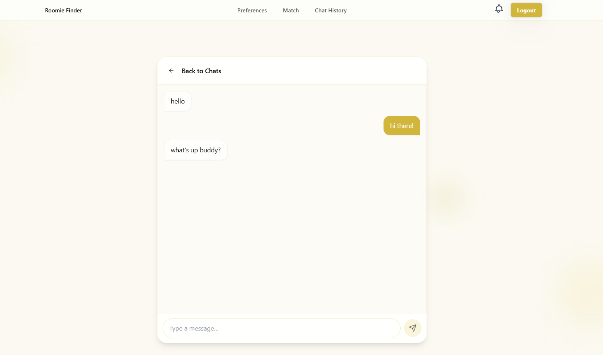

# Roomie Finder

A smart roommate-matching platform designed specifically for students and working professionals. It connects users based on key criteria such as shared interests, gender, and preferred location where they want to shift/live. The app also includes a built-in chat system, enabling users to communicate, discuss potential living arrangements, and build rapport before making any commitments. Whether you're relocating for education or career opportunities, our platform makes it easier to find a compatible and trustworthy roommate.

### Deployed Link - https://roomie-finder-v0.vercel.app/

## Features

* **Smart Roommate Matching:** Connect with compatible roommates based on shared interests, gender, lifestyle choices, and preferred living locations.
* **User Profiles and Preferences:** Create detailed profiles and update roommate preferences anytime for accurate and personalized matches.
* **Match Listing Interface:** View a curated list of potential roommates that align with your specified criteria.
* **Built-in Chat System:** Communicate directly within the platform to discuss living arrangements and get to know potential roommates before making any commitments.
* **Google Sign-In:** Secure and convenient authentication using your Google account.
* **Real-Time Notifications:** Receive instant updates on new matches and incoming messages to stay engaged and responsive.
* **Designed for Students and Professionals:** Specifically built to support the unique needs of individuals relocating for education or career opportunities.

## Technologies Used

* **Next.js:** A React framework for building server-rendered and statically generated web applications.
* **TypeScript:** A statically typed superset of JavaScript that enhances code maintainability and reduces errors.
* **Supabase:** An open-source Firebase alternative that provides a PostgreSQL database, authentication, storage, and more.
* **Shadcn UI:** A collection of accessible and reusable UI primitives built with Radix UI and Tailwind CSS.
